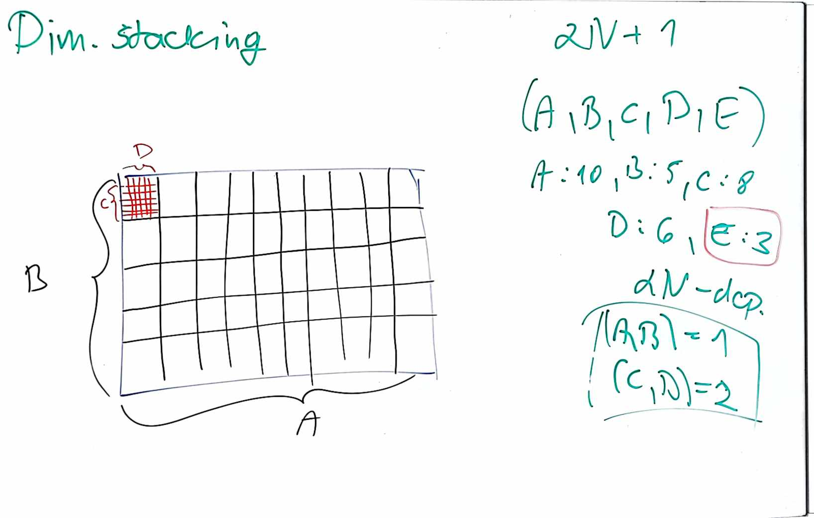

# Visualization methods

 Visualization of multidimensional data - scatterplot matrix, parallel coordinates, dimension stacking. Visualization of hierarchical structures - treemaps, radial techniques. Basic classes of interaction techniques, techniques used in screen space, object space, data, data structures.

PV251- lecture-07

 ## Multi-dimensional data

Consist of multiple types of attributes such as weitght, height, shoe size. Futhermore these triplets ($w_i$, $h_i$, $s_i$) form a set of multi-dimensional/ multi-variate data.

### Curse of dimensionality

The dimensionality affects the efficiency of algorithm. Data becomes sparse -- missing data.
When using such data for training ML algorithms the number of training samples grows exponentially with the number of dimensions.

The visualization of high dimensional data should provide us:

- way to detect clusters
- find regularities and irregularities
- identify relevant dimensions

# Techniques to visualize multi-dimensional data

**Hierarchical structures** -- store information about the relationships between data. The techniques to visualise such data can be divided into two categories:
- space filling -- making maximum use of screen space
- non-space filling -- the above is not a prioirity

## Line based
Vertical axis -- possible range of values, horizontal axis -- arrangment of records in a given dataset. Obviously this technique is not only for multivariatge data but rather single variable and juxtapositioning or superimpositioning is used to extend it to the multivariate datasets. 

The problem is overlaping lines:

- If dimensionss have common units.
  - stacked line chart technique (graph of the previous dimension is used as the basis for each additional dimension)
  - we could sort the records by one dimension
- dimensions do not have common units
  - multiple vertical axes with different labeling

## Radial techniques

Can be used to visualise hierarchical structures. For instance space-filling method to visualize the data is sunburst displays.

### RadViz
Force driven technique. Find equilibrium position of a point. For an N-dimensional data set, N "anchor" points are placed on the circumference of the circle, which represent the fixed ends of the N strings assigned to each data point. Usually to simplify things the circle has radius of 1 and the center is the origin.

Note that different placement and arrangement of anchors leads to different results and the transformation is lossy.

### Others
**Radial line chart**
-  drawn lines represent the offset from the circular 

**Radar**, **Star chart**, **Polar chart**, **Radial stacked bar chart**, **Radial bar charts**

## Treemaps

Common approach to visualize hierarchical structures. For instance sapce-filling rectangular treemap. The rectangle is divided into segments alternating the horizontal and vertical division.

## Dimensional stacking
Aims to map data from discrete N-dimensional space to a 2D image -- preserving most of the spatial information.

1. Start with odd ($2N+1$) number of dimensions (for even add additional default dim. of cardinality 1)
2. Select cardinality (number of unique values or size) for each dimension
3. Select one dimension as dependent variable others are independent
4. Create orderted pairs of independent variables
   1. Since there are $2N$ independent variables we will have $N$ pairs
   2. Assign a unique "velocity" (value from 1 to $N$) to each pair
5. Recursive virtual image creation
   1. Start with the pair corresponding to velocity 1. This pair creates a virtual image where the size is determined by the cardinality of the dimensions in the pair. The first dimension of the pair is oriented horizontally, and the second dimension is oriented vertically.
   2. At each position in this virtual image, create another virtual image for the next pair (velocity 2). This process continues recursively until all dimensions are represented.+
   3. Each virtual image is nested within the previous one, effectively mapping high-dimensional data into a unique location in the 2D image.
6. The value of the dependent variable at a given location in a multidimensional space is then mapped to the color / intensity of that location in the 2D image.

### Example
1. Data Dimensions
   1. Assume dimensions are A, B, C, D, E.
2. Cardinality
   1. Determine the cardinality for each dimension (e.g., A: 10, B: 5, C: 8, D: 6, E: 3)
3. Dependent and Independent Variables
   1. Choose dimension E as the dependent variable. Dimensions A, B, C, and D are independent.
4. Pairing and Velocity
   1. Create pairs: (A, B) and (C, D)
   2. Assign velocities: (A, B) = 1, (C, D) = 2

5. Creating Virtual Images:
   1. Start with pair (A, B) to create the first virtual image. A is horizontal (10 units), and B is vertical (5 units)
   2. For each position in the (A, B) grid, create a nested virtual image for pair (C, D). C is horizontal (8 units), and D is vertical (6 units)

6. Final Mapping. Each unique combination of (A, B, C, D) corresponds to a specific cell in the nested grid structure. The dependent variable E can be visualized as a value or attribute in each cell.

# Scatterplot matrix

Projects records from n-dimensional data space into any k-dimensional space of the output device. . Scatterplots can display individual records or summary records and can be structured based on the use of various projection techniques.

1. Multiple displays: display of several graphs, each displaying some of the dimensions (display using superimposition or juxtaposition)

2. Dimension subsetting: allow the user to select only a certain subset of input
dimensions to be displayed

3. Dimension reduction: PCA, multidimensional scaling

4. Dimension embedding: mapping of dimensions to other graphic attributes in addition to position, such as color, size, and shape

# GPT Summary of lecture 7, 8, 9

## Summary of Visualization Techniques from "Vizz.pdf"

### Visualization Methods

**Scatterplots**
- *Scatterplot Matrix*: A grid of scatterplots, each representing a pair of dimensions. It visualizes N² pairs for N dimensions, with symmetry along the main diagonal, often used to show histograms for individual dimensions.
  
- *Parallel Coordinates*: Plots each dimension on a parallel axis, allowing for visualization of high-dimensional data by connecting data points across these axes.

- *Dimension Stacking*: Maps multidimensional data into a 2D space by hierarchically dividing the dimensions and displaying them in nested grids
  
### Visualization of Multidimensional Data

**Multiple Displays**
- *Dimension Subsetting*: Allows selection of a subset of dimensions to visualize. Utilizes algorithms to identify dimensions with the most relevant information.

- *Dimension Reduction*: Techniques like PCA (Principal Component Analysis) or Multidimensional Scaling reduce the number of dimensions while preserving relationships between data points.

- *Dimension Embedding*: Maps dimensions to graphic attributes like color, size, and shape 

### Visualization of Hierarchical Structures

**Treemaps**
- Visualizes hierarchical data using nested rectangles. Each branch of the hierarchy is represented by a colored rectangle containing smaller rectangles representing sub-branches.

**Radial Techniques**
- Represent hierarchical data in a circular layout, with the root at the center and branches radiating outward. This includes techniques like Radial Tree and Sunburst diagrams 
  
### Basic Classes of Interaction Techniques

**Screen Space Techniques**
- Techniques focused on optimizing the use of available screen space for visualization. Examples include:
  - *Zooming*: Allows users to focus on a specific area by enlarging it.
  - *Panning*: Moves the view to different parts of the visualization.
  - *Focus+Context*: Combines detailed views (focus) with an overview (context) to maintain orientation.

**Object Space Techniques**
- Interaction techniques that involve manipulation of the data objects themselves, such as:
  - *Selecting*: Highlighting or isolating particular data points for detailed examination.
  - *Filtering*: Removing data points that do not meet certain criteria to reduce clutter.
  - *Rearranging*: Changing the order or position of data points to reveal patterns.

**Data Interaction Techniques**
- Techniques for interacting directly with the data, including:
  - *Dynamic Queries*: Allow users to interactively change parameters of the data query and instantly see the results. This can involve sliders, checkboxes, or other controls to filter data on-the-fly.
  - *Brushing*: Highlighting data points across multiple linked visualizations to show their relationships.
  - *Linking*: Connecting different visualizations such that interactions in one (e.g., selecting a data point) are reflected in another.

**Data Structure Techniques**
- Focus on manipulating the underlying data structures, such as:
  - *Sorting*: Arranging data points based on a particular order, like ascending or descending values.
  - *Grouping*: Clustering data points into categories based on shared attributes.
  - *Clustering*: Using algorithms to group similar data points together to identify patterns 

# Claude: Interaction Spaces in Information Visualization - lecture 09

## 1. Basic Classes of Interaction Techniques:
a. **Navigation**: Users change their view by adjusting camera position or scale. Examples include rotating a 3D object or zooming into a specific area of a graph.

b. **Selection**: Users isolate specific objects or areas for further actions. For instance, clicking on a data point in a scatter plot to view its details.

c. **Filtering**: Users reduce the amount of data displayed by setting constraints. An example is using sliders to show only data within certain value ranges.

d. **Reconfiguration**: Users reorganize data to reveal hidden properties. This could involve sorting table rows to highlight trends or using PCA to project high-dimensional data into 2D space.

e. **Encoding**: Users change graphic attributes to reveal data properties. For example, adjusting point size in a scatter plot to represent a third variable.

f. **Aggregation (Merging)**: Users combine views to build a richer mental model. An instance is linked brushing, where selecting a cluster in parallel coordinates highlights it in other views.

g. **Abstraction/Concretization**: Users adjust level-of-detail. For example, using distortion to magnify an area of interest while reducing detail elsewhere.

## 2. Screen Space Techniques:
These operate at the pixel level, treating the screen as a 2D grid.

a. **Navigation**: Involves panning (moving the view), zooming (scaling pixels), or rotating. No new data is loaded; it's all pixel manipulation.

b. **Selection**: Users classify each pixel as selected or not. They might click individual pixels or define areas (rectangles, lassos) to select.

c. **Distortion**: Pixels are transformed, like in fisheye or rubber sheet techniques. The fisheye effect magnifies an area while shrinking the surroundings.

d. **Challenges**: Transformations can create holes (requiring interpolation) or overlapping pixels (often averaged out).

## 3. Object Space Techniques (3D Surfaces):
Here, data is mapped onto 3D geometric objects.

a. **Navigation**: Users move around objects to observe data-mapped surfaces, needing both global and detailed views.

b. **Selection**: Users click on objects or choose from a list, like selecting a country on a 3D globe.

c. **Remapping**: Data is mapped to different objects, such as switching from a flat map to a sphere.

d. **Distortion**: Objects encapsulate distortion functions. Examples are perspective walls (focusing on one panel) and hyperbolic projections.

e. **Process**: Data is first mapped to a 3D structure, then transformed and projected onto the screen.

## 4. Data Value Space Techniques:
These work directly with the data values.
a. **Navigation**: Data values define the view. Panning shifts the value range, while zooming increases or decreases this range.

b. **Selection**: Users specify data value ranges, like in data-driven brushing or using query sliders.

c. **Filtering**: The most intuitive here—users reduce data by trimming values outside a range or removing certain dimensions.

d. **Distortion**: Data values are transformed before visualization. Each dimension can have its own transform function.

## 5. Data Structure Space Techniques:
These interact with how data is organized (lists, tables, hierarchies, graphs).

a. **Navigation**: Users move along the structure, like traversing a hierarchy or scrolling through records.

b. **Selection**: Users identify areas within the structure, such as highlighting a branch in a tree.

c. **Filtering**: Based on structural properties—e.g., showing only nodes within two "hops" in a graph.

d. **Distortion**: Common in hierarchies due to information density. Examples include radial mappings.

e. **Example**: In multivariate data, users can rearrange dimensions to reveal patterns. This might involve manual manipulation or algorithmic optimization to find high-quality arrangements.

## 6. Other Spaces:
a. **Attribute Space**: Users interact with graphical attributes. They might select color map entries or filter data based on quality attributes.

b. **Structure Visualization Space**: Users interact with the visualization structure itself, like rearranging axes in parallel coordinates.

Each space offers unique ways to interact with data, focusing on different aspects: raw pixels, 3D objects, data values, data organization, graphical attributes, or visualization structure. The choice depends on the data type, task, and desired insights. Often, a visualization system will combine techniques from multiple spaces to provide a rich, multi-faceted interaction experience.